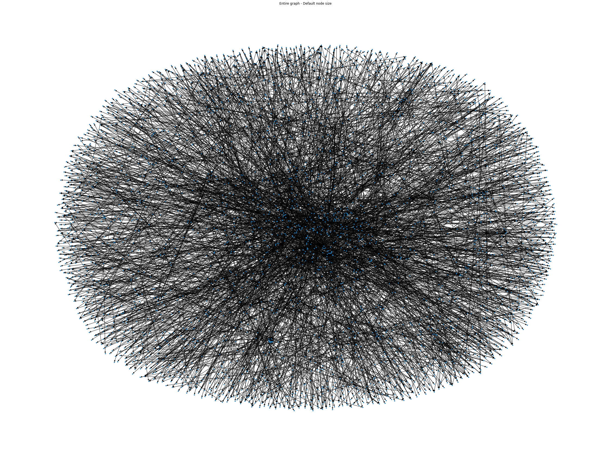
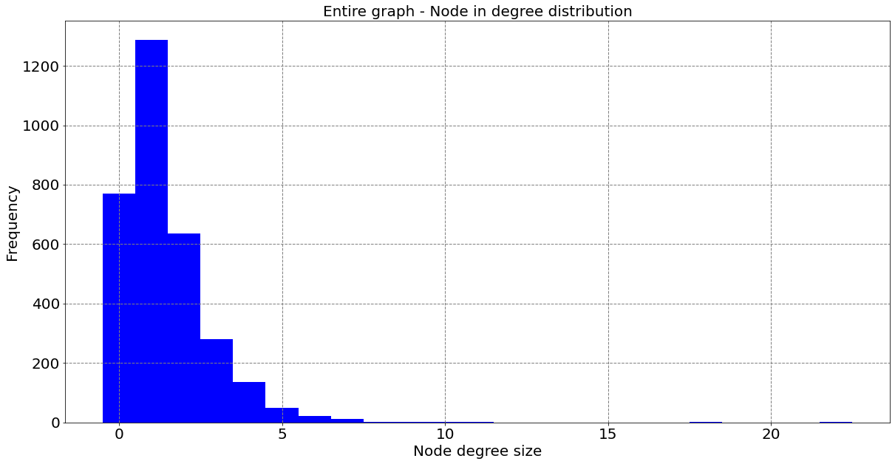
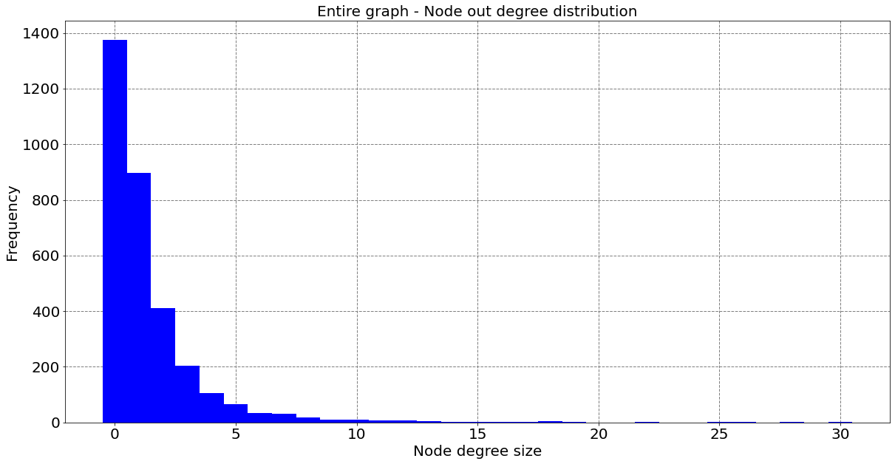
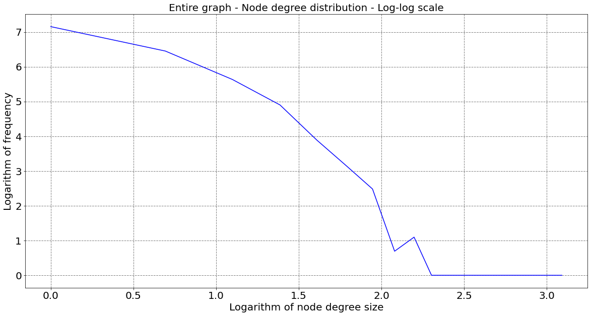
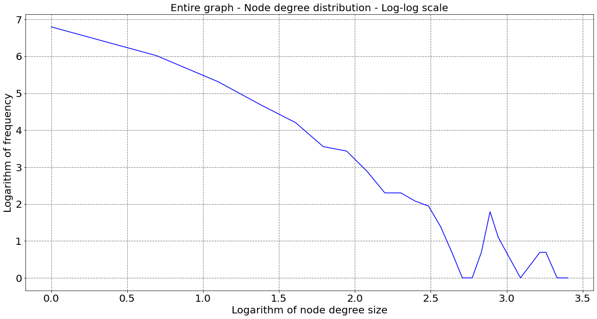
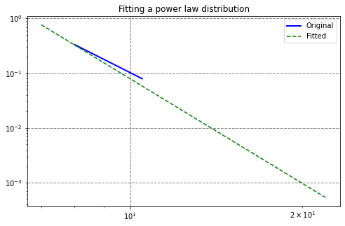
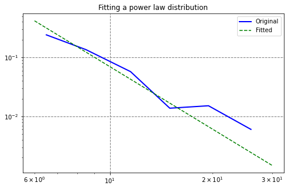
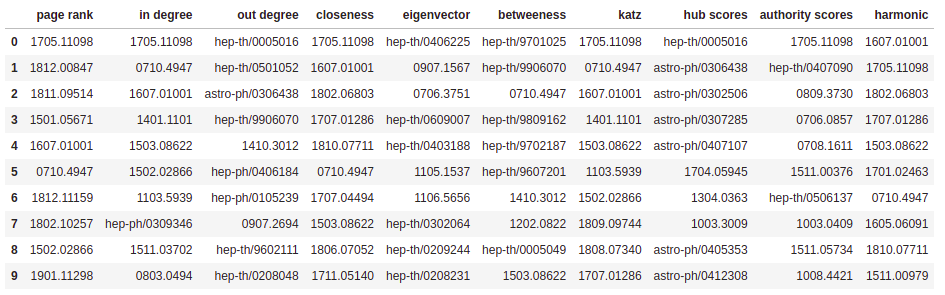
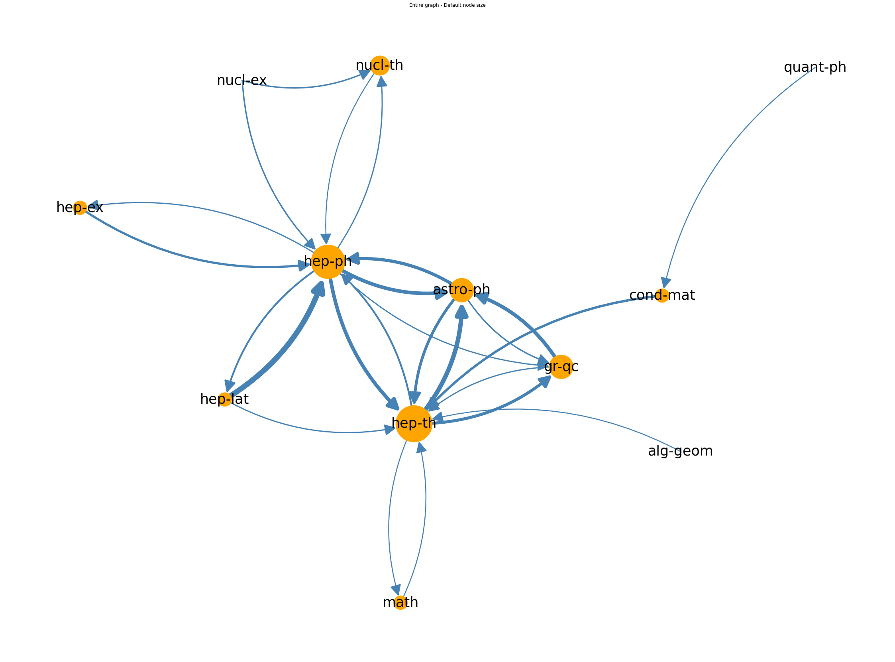
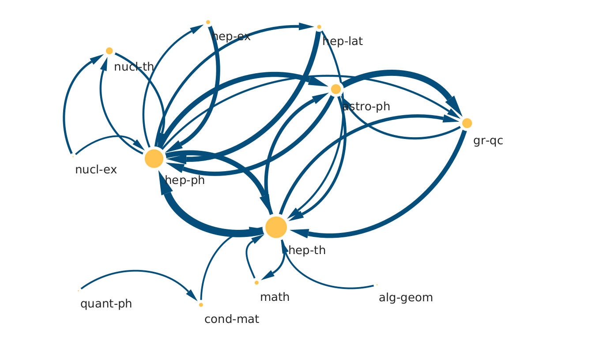

    

# Project ArXiv Citation Network

## Overview

This project involved the analysis of the ArXiv citation network.

## Data

The data was extracted from: [https://github.com/mattbierbaum/arxiv-public-datasets/releases/tag/v0.2.0](https://github.com/mattbierbaum/arxiv-public-datasets/releases/tag/v0.2.0). More exactly, we'll use the file "internal-references-v0.2.0-2019-03-01.json.gz", which contains the list of papers and their references, all papers using their arXiv IDs.

## Results

### Citation Network using NetworkX

### In-degree and Out-degree analysis

### Table of Centralities

The most important centrality is PageRank, because this measure uncovers nodes whose influence extends beyond their direct connections into the wider network.

### Field Category Network using NetworkX

### Field Category Network using Cytoscape

## References

- Clement, C. B., Bierbaum, M., O’Keeffe, K. P., & Alemi, A. A. (2019). On the Use of ArXiv as a Dataset. arXiv [cs.IR]. Opgehaal van http://arxiv.org/abs/1905.00075

- Clauset, A., Shalizi, C. R., & Newman, M. E. J. (2009). Power-Law Distributions in Empirical Data. SIAM Review, 51(4), 661–703. doi:10.1137/070710111

- Page, L., Brin, S., Motwani, R., & Winograd, T. (1998). The PageRank Citation Ranking: Bringing Order to the Web.

<!---

git pull
git add -A
git commit -m "updating readme"
git push -u origin main

--->